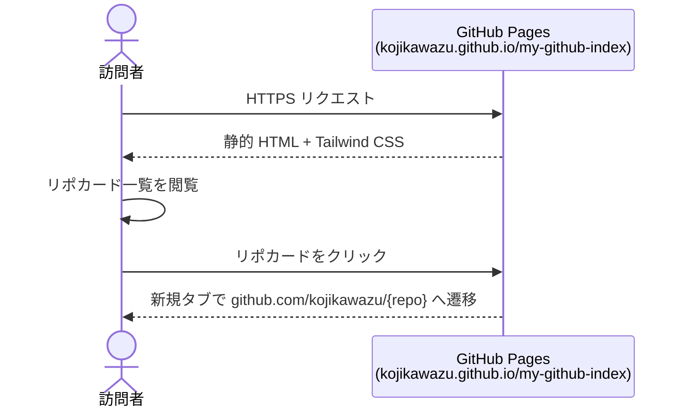
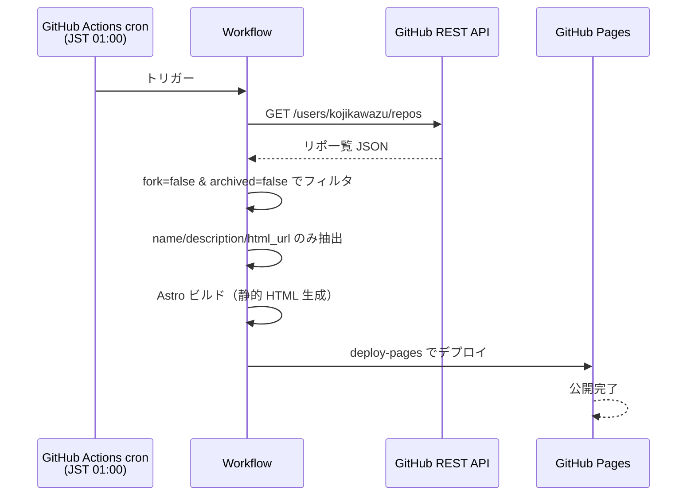

# 03. 機能仕様書（Functional Specification）

各機能の詳細な振る舞い・画面遷移・ビジネスロジックを定義する。

## 機能詳細

### F-01: リポジトリ一覧表示

- **入力**: なし（ビルド時に GitHub API から取得済みの JSON データ）
- **処理**: フィルタ済みリポ配列を順に `RepoCard` コンポーネントで描画
- **出力**: 静的 HTML（リポカードの縦並びまたはグリッド）
- **例外**:
  - リポ 0 件 → 「リポジトリがありません」メッセージを表示
  - description が null/空 → 該当行を非表示またはダッシュ表示

### F-02: リポジトリリンク

- **入力**: ユーザーのクリック操作
- **処理**: リポカードまたはリポ名のクリックで `<a>` タグ経由で遷移
- **出力**: 新規タブで GitHub のリポページが開く
- **例外**: なし（クライアント側で完結）

### F-03: 定期再ビルド

- **入力**: cron トリガー（毎日 JST 01:00）または `workflow_dispatch`
- **処理**:
  1. GitHub Actions ワークフロー起動
  2. Node.js セットアップ → `npm ci`
  3. ビルドスクリプト内で GitHub API 呼び出し（`/users/kojikawazu/repos?type=owner&per_page=100`）
  4. `fork === false` かつ `archived === false` でフィルタ
  5. `name` / `description` / `html_url` のみ抽出して JSON 化
  6. Astro が JSON を読み込み静的 HTML を生成
  7. `actions/deploy-pages` で GitHub Pages へデプロイ
- **出力**: 更新された GitHub Pages サイト
- **例外**:
  - API 呼び出し失敗 → ワークフロー失敗（ログで確認）
  - rate limit 超過 → 無認証 60/hr で 1 ユーザーぶんなら通常起きないが、`GITHUB_TOKEN` を使えば 5000/hr に拡張可能

## ユーザーフロー

### メインフロー: リポ一覧を見る



### ビルドフロー: データ更新（裏側）



## UI / UX 仕様

### 画面構成（1 ページ構成）

```
┌────────────────────────────────────────────┐
│  ヘッダー                                   │
│  - サイトタイトル「My GitHub Index」       │
│  - サブタイトル                            │
├────────────────────────────────────────────┤
│  ## プロフィール (n)                       │
│  ┌──────────┐ ┌──────────┐                 │
│  │ Card     │ │ Card     │ ...             │
│  └──────────┘ └──────────┘                 │
├────────────────────────────────────────────┤
│  ## 個人開発 (n)                           │
│  ┌──────────┐ ┌──────────┐                 │
│  │ Card     │ │ Card     │ ...             │
│  └──────────┘ └──────────┘                 │
├────────────────────────────────────────────┤
│  ## 学習 / AI / アルゴリズム / その他 ...  │
├────────────────────────────────────────────┤
│  フッター                                   │
│  - 最終ビルド時刻                          │
│  - GitHub プロフィールへのリンク           │
└────────────────────────────────────────────┘
```

### コンポーネント

| コンポーネント | 責務 |
|---------------|------|
| `Layout.astro` | HTML 全体構造・`<head>` メタタグ・全ページ共通 |
| `Header.astro` | サイトタイトル・サブタイトル表示 |
| `CategorySection.astro` | 1 カテゴリ分のセクション（見出し + 件数 + カードグリッド） |
| `RepoCard.astro` | 1 リポの表示（名前・概要・リンク） |
| `Footer.astro` | 最終ビルド時刻・プロフィールリンク |

### スタイリング方針

- **Tailwind CSS** のユーティリティクラスで完結させる（カスタム CSS は最小限）
- カードレイアウトは `grid` または `flex` でレスポンシブ対応
  - モバイル（〜768px）: 1 カラム
  - PC（768px〜）: 2 〜 3 カラム
- ダークモード対応は **MVP では見送り**（必要なら後で `dark:` バリアント追加）

### アクセシビリティ

- リンクには可読なテキスト（リポ名）を必ず含める
- `<a target="_blank">` には視覚的な「外部リンク」アイコン or aria-label
- 色のみで情報を伝えない（コントラスト比 WCAG AA を目安）

## ビジネスロジック

### リポジトリのフィルタリング

```typescript
// 擬似コード（実装は front/src/lib/github.ts）
function filterRepos(repos: GitHubRepo[]): DisplayRepo[] {
  return repos
    .filter(r => !r.fork)        // fork を除外
    .filter(r => !r.archived)    // archived を除外
    .map(r => ({
      name: r.name,
      description: r.description ?? '',
      url: r.html_url,
      category: pickCategory(r.topics),  // 定義済みカテゴリと一致する topic を順次探す
    }));
}
```

### カテゴリの決定ロジック

```typescript
// 定義済みカテゴリ（CATEGORIES）の順で topics を走査し、最初にマッチしたものを採用
// どれにも一致しなければ "other"（その他）
function pickCategory(topics: string[]): CategoryKey {
  for (const cat of CATEGORIES) {
    if (cat.key === "other") continue;
    if (topics.includes(cat.key)) return cat.key;
  }
  return "other";
}
```

### グループ化

```typescript
// CATEGORIES の順で空でないカテゴリだけ表示
function groupByCategory(repos: DisplayRepo[]) {
  return CATEGORIES
    .map(cat => ({ ...cat, repos: repos.filter(r => r.category === cat.key) }))
    .filter(g => g.repos.length > 0);
}
```

### ソート順

- **カテゴリ間**: 定義順（プロフィール → 個人開発 → 学習 → AI → アルゴリズム → その他）
- **カテゴリ内**: `updated_at` の降順（API 取得時の `sort=updated` で確定）
- `updated_at` は表示項目には含めないが、ソートには使う
