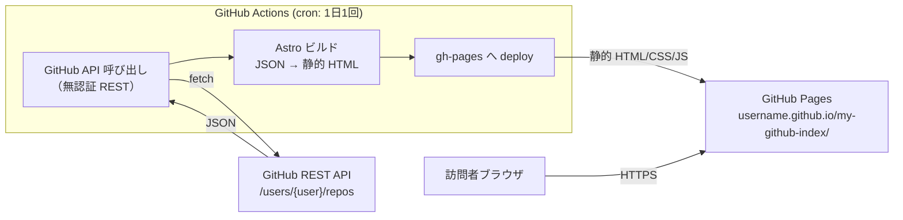

# 09. アーキテクチャ仕様書（Architecture Specification）

システム構成・技術スタック・インフラ・デプロイ方針を定義する。

## システム構成



**ポイント**:

- ランタイムでは GitHub API を一切呼ばない（ビルド時にすべて解決）
- 訪問者は純粋に静的ファイルだけを取得 → 高速・rate limit 無関係
- データの鮮度はビルド頻度に依存（1 日 1 回想定）

## 技術スタック

| レイヤ | 採用技術 | 採用理由 |
|--------|---------|---------|
| 静的サイトジェネレータ | **Astro 5.x** | 静的サイト特化・JS フレームワーク非依存・島アーキで部分的にインタラクティブに（Astro 6 は Rolldown + Tailwind v4 統合が未成熟のため当面 5 系を採用） |
| 言語 | TypeScript | 型安全・GitHub API のレスポンスを型で扱える |
| スタイリング | **Tailwind CSS** | Astro 公式 integration あり・ユーティリティクラスでカード UI を簡潔に書ける |
| データ取得 | GitHub REST API（無認証） | rate limit 60/hr で十分（ビルド時のみ呼び出すため） |
| CI / 自動化 | GitHub Actions | GitHub ネイティブ・Pages デプロイと相性が良い |
| ホスティング | GitHub Pages（プロジェクトページ） | 無料・github.io ドメイン・公開リポと相性 |

## インフラ

### 環境

| 環境 | 用途 | URL |
|------|------|-----|
| local | 開発・確認 | `http://localhost:4321/my-github-index/`（Astro デフォルト） |
| production | 公開 | `https://kojikawazu.github.io/my-github-index/` |

### ディレクトリ構成（想定）

```
my-github-index/
├── .github/
│   └── workflows/
│       └── deploy.yml          # cron + ビルド + Pages デプロイ
├── src/
│   ├── pages/
│   │   └── index.astro         # トップページ（リポ一覧）
│   ├── components/
│   │   └── RepoCard.astro      # リポ 1 件分の表示コンポーネント
│   └── lib/
│       └── github.ts           # GitHub API 呼び出し
├── public/                     # 静的アセット
├── astro.config.mjs            # base: '/my-github-index/' を設定
└── package.json
```

## デプロイ

### フロー

1. **トリガー**:
   - `main` への push（手動更新時）
   - cron: **毎日 JST 01:00（UTC 16:00 → `cron: '0 16 * * *'`）**
   - `workflow_dispatch`（手動実行用）
2. **ビルド**:
   - `npm ci`
   - `npm run build` （内部で GitHub API を叩き、静的 HTML を生成）
3. **デプロイ**:
   - GitHub Actions 公式の `actions/deploy-pages` を使用
   - `gh-pages` ブランチ運用ではなく、Pages の「Source: GitHub Actions」方式を採用（モダンな推奨方式）

### ロールバック

- 前回ビルドのコミットを Revert → 自動的に再デプロイ
- または GitHub Pages の「Actions タブ」から過去の成功 workflow を再実行

## 将来の拡張（private リポ版との関係）

- 本プロジェクトの `src/lib/github.ts` を「データ取得の抽象化レイヤ」として設計
- 次回 private 版では同レイヤの実装だけ差し替え（PAT 認証 + private リポ取得）
- 表示側（`components/`, `pages/`）はそのまま流用可能になるよう疎結合を保つ
