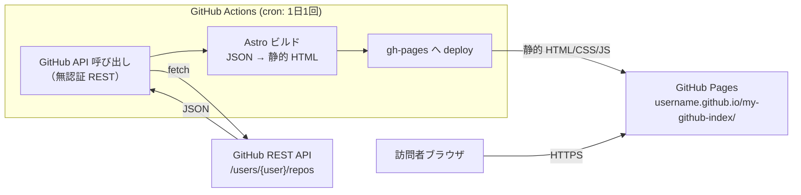

# 09. アーキテクチャ仕様書（Architecture Specification）

システム構成・技術スタック・インフラ・デプロイ方針を定義する。

## システム構成


```mermaid
graph LR
    subgraph CI["GitHub Actions (cron: 1日1回)"]
        Fetch["GitHub API 呼び出し<br/>（無認証 REST）"]
        Build["Astro ビルド<br/>JSON → 静的 HTML"]
        Deploy["gh-pages へ deploy"]
    end

    GHAPI["GitHub REST API<br/>/users/{user}/repos"]
    Pages["GitHub Pages<br/>username.github.io/my-github-index/"]
    User["訪問者ブラウザ"]

    Fetch -->|fetch| GHAPI
    GHAPI -->|JSON| Fetch
    Fetch --> Build
    Build --> Deploy
    Deploy -->|静的 HTML/CSS/JS| Pages
    User -->|HTTPS| Pages
```

**ポイント**:

- ランタイムでは GitHub API を一切呼ばない（ビルド時にすべて解決）
- 訪問者は純粋に静的ファイルだけを取得 → 高速・rate limit 無関係
- データの鮮度はビルド頻度に依存（1 日 1 回想定）

## 技術スタック

| レイヤ | 採用技術 | 採用理由 |
|--------|---------|---------|
| 静的サイトジェネレータ | **Astro 5.x** | 静的サイト特化・JS フレームワーク非依存・島アーキで部分的にインタラクティブに（Astro 6 は Rolldown + Tailwind v4 統合が未成熟のため当面 5 系を採用。検証記録は「Astro 6 移行の検証記録」参照） |
| 言語 | TypeScript | 型安全・GitHub API のレスポンスを型で扱える |
| スタイリング | **Tailwind CSS** | Astro 公式 integration あり・ユーティリティクラスでカード UI を簡潔に書ける |
| データ取得 | GitHub REST API（無認証） | rate limit 60/hr で十分（ビルド時のみ呼び出すため） |
| テスト | **Vitest** | Vite ベースで Astro と親和性が高く、純粋な TS ロジックなら設定ファイル不要で動く |
| CI / 自動化 | GitHub Actions | GitHub ネイティブ・Pages デプロイと相性が良い |
| ホスティング | GitHub Pages（プロジェクトページ） | 無料・github.io ドメイン・公開リポと相性 |

### Astro 6 移行の検証記録

| 日付 | 検証バージョン | 結果 | 判断 |
|---|---|---|---|
| 2026-10-02 | astro 6.4.8（Dependabot #15） | `npm install` だけではビルド失敗。Astro 6 は Vite 7 を使うが、`@tailwindcss/vite` が hoist された Vite 8 を解決し `Missing field tsconfigPaths` エラー。`npm dedupe` で Vite 7 に統一すればビルド成功・出力 HTML も同一 | **5 系で様子見**。依存更新のたびに Vite が再分裂するリスクがあり、6 系の新機能も不要なため見送り |

再検証の目安: `@tailwindcss/vite` と Astro 6 が同一 Vite メジャーで解決される（dedupe 不要になる）こと。

## インフラ

### 環境

| 環境 | 用途 | URL |
|------|------|-----|
| local | 開発・確認 | `http://localhost:4321/my-github-index/`（Astro デフォルト） |
| production | 公開 | `https://kojikawazu.github.io/my-github-index/` |

### ディレクトリ構成

フロントエンド（Astro 一式）は `front/` 配下に集約し、ルートはドキュメント・CI 設定・Claude ルールのみとする。

```
my-github-index/
├── .github/
│   └── workflows/
│       └── deploy.yml          # cron + ビルド + Pages デプロイ
│                               # （npm 系ステップは working-directory: ./front）
├── docs/                       # 仕様書（01〜11）
├── .claude/                    # Claude Code 用ルール
├── README.md
└── front/                      # Astro プロジェクトルート
    ├── src/
    │   ├── pages/
    │   │   └── index.astro     # トップページ（リポ一覧）
    │   ├── components/
    │   │   ├── Layout.astro
    │   │   ├── Header.astro
    │   │   ├── Footer.astro
    │   │   ├── CategorySection.astro
    │   │   └── RepoCard.astro
    │   ├── lib/
    │   │   ├── github.ts       # GitHub API 呼び出し
    │   │   ├── github.test.ts  # ユニットテスト（Vitest）
    │   │   ├── categories.ts   # カテゴリ定義 + pickCategory()
    │   │   └── categories.test.ts
    │   └── styles/
    │       └── global.css
    ├── public/                 # 静的アセット
    ├── astro.config.mjs        # base: '/my-github-index' を設定
    ├── package.json
    └── tsconfig.json
```

**運用ルール**: ローカル開発・ビルドは `cd front` してから `npm` コマンドを実行する。CI 側は `working-directory: ./front` で同じ挙動になる。

## デプロイ

### フロー

1. **トリガー**:
   - `main` への push（手動更新時）
   - cron: **毎日 JST 01:00（UTC 16:00 → `cron: '0 16 * * *'`）**
   - `workflow_dispatch`（手動実行用）
2. **ビルド**:
   - `npm ci`
   - `npm run build` （内部で GitHub API を叩き、静的 HTML を生成）
3. **デプロイ**:
   - GitHub Actions 公式の `actions/deploy-pages` を使用
   - `gh-pages` ブランチ運用ではなく、Pages の「Source: GitHub Actions」方式を採用（モダンな推奨方式）

### ロールバック

- 前回ビルドのコミットを Revert → 自動的に再デプロイ
- または GitHub Pages の「Actions タブ」から過去の成功 workflow を再実行

### 運用上の注意: cron ワークフローの自動無効化

- GitHub の仕様により、**リポジトリに 60 日間アクティビティ（コミット等）がないと、`schedule` を含むワークフローは自動で無効化される**（状態: `disabled_inactivity`）。
- 無効化中は cron だけでなく **push / `workflow_dispatch` も含めてワークフロー全体が動かない**ため、サイトが更新されなくなる。
- `workflow_dispatch` による手動実行はアクティビティとしてカウントされない。
- 復旧手順:
  1. `gh workflow enable deploy.yml`（または Actions タブの「Enable workflow」）で再有効化
  2. `gh workflow run deploy.yml --ref main` で即時再デプロイ
- 予防: Dependabot PR のマージ等で、60 日以内に `main` へのコミットが発生する状態を保つ。

## 将来の拡張（private リポ版との関係）

- 本プロジェクトの `front/src/lib/github.ts` を「データ取得の抽象化レイヤ」として設計
- 次回 private 版では同レイヤの実装だけ差し替え（PAT 認証 + private リポ取得）
- 表示側（`components/`, `pages/`）はそのまま流用可能になるよう疎結合を保つ
